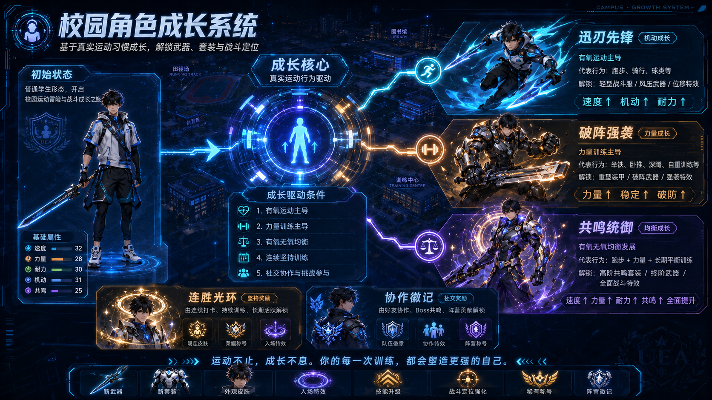
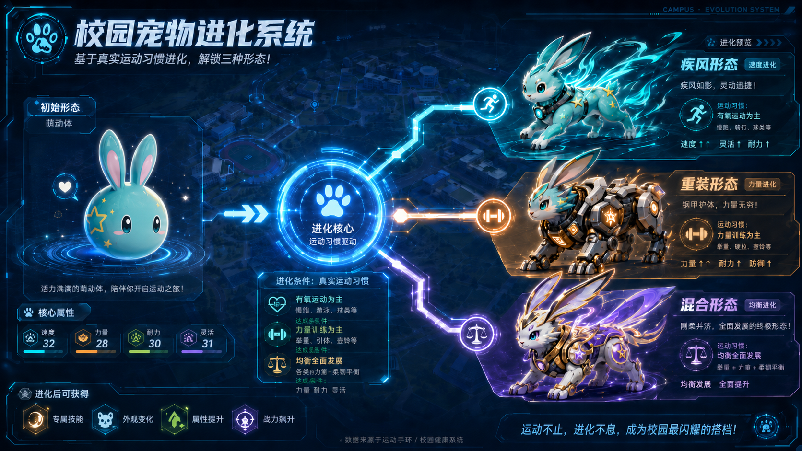
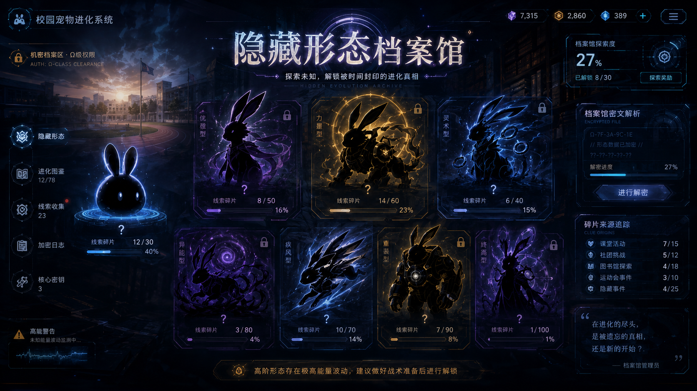
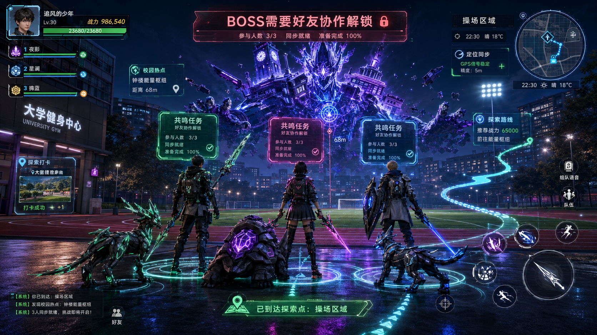

# 🎮 FitVenture · 校园灵兽

> 把校园运动变成一场冒险 —— **真实运动 → 宠物进化 + AI 运动分身成长 + 重社交协作**。


---

## 🚀 本地运行

```bash
git clone https://github.com/你的用户名/fitventure-demo.git
cd fitventure-demo
# 直接浏览器打开 fitventure.html，或部署到 GitHub Pages
```

## 🎯 核心玩法

### 1️⃣ 校园角色成长系统



初始普通学生形态，由真实运动习惯塑形，解锁三大成长路径：

- 🌪️ **迅刃先锋**（机动成长）· 有氧主导
- ⚙️ **破阵强袭**（力量成长）· 力量主导
- ✨ **共鸣统御**（均衡成长）· 全面发展

### 2️⃣ 校园灵兽进化系统



主宠由你的训练结构共同塑形 —— 疾风 / 重装 / 混合三种主形态，进化方向不固定。

### 3️⃣ 神秘隐藏形态（第三大核心玩法）



由特定**时间 / 地点 / 社交关系 / 行为序列**触发的稀有形态。线索含蓄，需在校园中持续探索。

### 4️⃣ 社交协作 · 联机玩法



- 🏛️ **联机 BOSS 战** · 健身房地标限定，3 人组队
- ⊕ **双生羁绊** · 与同一好友 3 次共鸣可触发隐藏形态
- 🛡️ **阵营贡献** · 工学院 / 宿舍联盟周排行

---

## 📍 LBS 探索 · 宝可梦 GO 风格

地图占主屏（Leaflet + OSM 暗色瓦片，免 API key），5 大地标各有独占玩法：

| 地标 | 限定玩法 |
|---|---|
| 💪 健身房 | 力量训练 · 联机 BOSS |
| ⚽ 足球场 | 有氧跑步 · 球类对抗 · 晨曦线索 |
| 🏀 篮球场 | 投篮挑战 · 三人对抗 |
| 📚 图书馆 | 隐藏信号 · 神秘档案 |
| 🏠 宿舍区 | 阵营任务 |

无氧训练、球类、BOSS 战必须在对应地标才能开启；有氧 / 拉伸恢复任意位置可用。

---

## 🎬 推荐体验路径（60 秒看完核心闭环）

1. 打开默认 **角色** Tab —— 主角立绘 + 五维属性 + 三大成长路径 + 装备栏
2. 切到 **探索** —— 真实地图，点「健身房」pin → 底部按钮自动解锁力量训练
3. 完成「35 分钟力量训练」—— 资源 / 生态 / 进化倾向 / 隐藏线索全 Tab 同步更新
4. 切到 **宠物** —— 看 3 只灵兽立绘、含蓄的隐藏档案残片、训练主宠
5. 切到 **好友** —— 邀请 Jason 共鸣，推进双生羁绊形态

---

---

## 🛠 技术栈

- 纯前端 HTML + CSS + JS（无后端、无登录、无真实 GPS）
- **Leaflet + CartoDB Dark Matter** 暗色地图
- localStorage 状态持久化
- Noto Sans SC + Orbitron 字体
- 单文件可直接 GitHub Pages 部署

---

## ⚖️ 声明

本作品为通用校园产品原型，使用通用建筑名称（健身房 / 图书馆 / 足球场 / 宿舍区 / 篮球场），与任何具体高校无商业合作关系。
